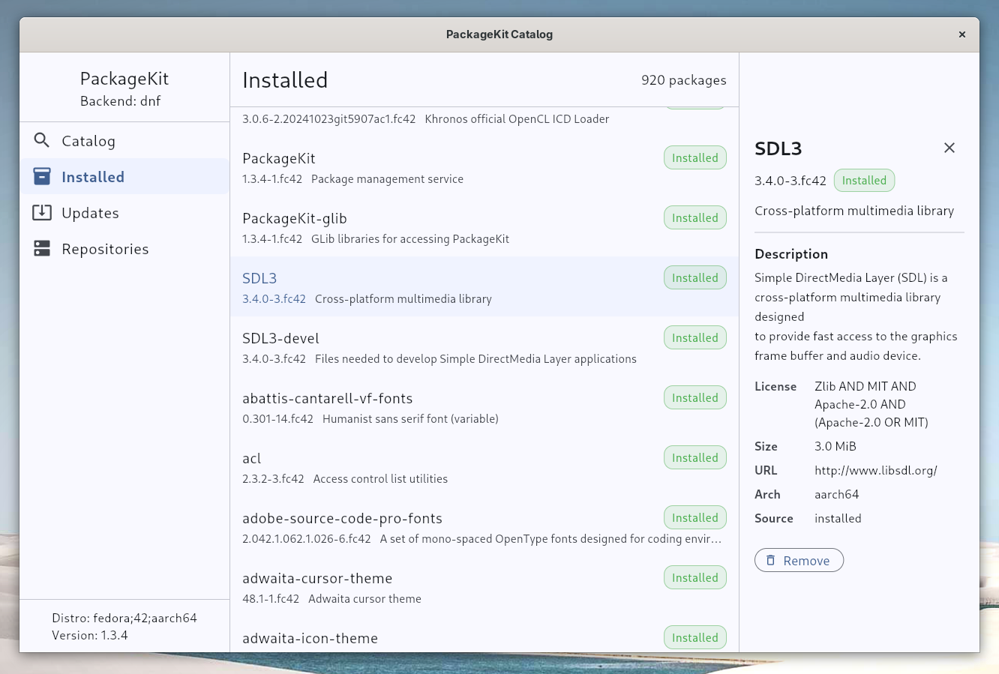

# packagekit_dart

Typed Dart API for the [PackageKit](https://www.freedesktop.org/software/PackageKit/) D-Bus
package manager abstraction layer. Supports search, install, update, remove, and repo management
across APT, DNF, Zypper, and other PackageKit backends.

Uses [sdbus-cpp](https://github.com/Kistler-Group/sdbus-cpp) v2 for typed D-Bus signal delivery
via `Dart_PostCObject_DL`.

## Platform support

| Platform | Search / info | Install / remove / update | Repo management |
|----------|:---:|:---:|:---:|
| Ubuntu 22.04+ (APT) | Y | Y (polkit) | Y (polkit) |
| Fedora 38+ (DNF) | Y | Y (polkit) | Y (polkit) |
| openSUSE (Zypper) | Y | Y (polkit) | Y (polkit) |
| Arch (Alpm) | Y | Y (polkit) | Y (polkit) |
| Any Linux with PackageKit >= 1.2 | Y | Y | Y |
| macOS / Windows | - | - | - |

PackageKit is socket-activated on all modern distributions. If the daemon is not running when
`PkClient.connect()` is called, systemd will start it automatically.

## Prerequisites

PackageKit must be installed on the target system. Without it, `PkClient.connect()` will throw
`PkServiceUnavailableException`.

**Ubuntu/Debian:**
```bash
sudo apt install packagekit
```

**Fedora:**
```bash
sudo dnf install PackageKit
```

**openSUSE:**
```bash
sudo zypper install PackageKit
```

**Arch:**
```bash
sudo pacman -S packagekit
```

Verify the daemon is available:
```bash
busctl status org.freedesktop.PackageKit 2>/dev/null && echo "OK" || echo "Not available"
```

> **Note:** PackageKit requires a real Linux system with systemd and D-Bus. It will not work in
> minimal containers, chroots, or WSL environments that lack a system bus and the PackageKit
> `.service` file.

## Quick start

```dart
import 'package:packagekit_dart/packagekit_dart.dart';

Future<void> main() async {
  final client = await PkClient.connect();
  print('Backend: ${client.properties?.backendName}');

  // Search for packages
  final tx = client.searchName('firefox');
  await for (final pkg in tx.packages) {
    print('${pkg.id.name} ${pkg.id.version}: ${pkg.summary}');
  }
  await tx.result;

  await client.close();
}
```

## Dependency resolution and the simulate-first pattern

PackageKit performs full dependency resolution in the backend (libsolv for DNF/Zypper,
libapt-pkg for APT). The recommended workflow for install/remove/update is:

```
1. simulateInstall(ids)  -->  PkInstallPlan (dry-run, no system changes)
2. Display plan to user, ask for confirmation
3. installPackages(ids)  -->  Real install with live progress
```

```dart
// Simulate first — see exactly what will change
final plan = await client.simulateInstall(packageIds);
print('${plan.installing.length} to install, '
    '${plan.updating.length} to update, '
    '${plan.removing.length} to remove');

if (!plan.isEmpty) {
  // Execute the real install
  final tx = client.installPackages(packageIds);
  await for (final p in tx.progress) {
    print(p.progressLabel);
  }
  await tx.result;
}
```

### TOCTOU note

`simulateInstall()` and `installPackages()` are separate PackageKit transactions.
The daemon's dependency solver runs independently in each. Between the two calls,
another process may install packages, refresh the cache, or modify repos. The real
install will silently recompute a fresh dependency plan that may differ from the
simulate plan.

This is expected behavior. Always pass the **original package IDs** to
`installPackages()`, not `plan.allIds` — let the backend resolve the current
state at install time.

## Flutter example

A full-featured Flutter desktop catalog app is included at
[`example/packagekit_catalog/`](example/packagekit_catalog/).



## Examples

| Example | Description |
|---------|-------------|
| [`search.dart`](example/search.dart) | Search packages by name |
| [`install.dart`](example/install.dart) | Simulate-first install with live progress |
| [`simulate_install.dart`](example/simulate_install.dart) | Dry-run dep resolution (scripting-friendly) |
| [`get_updates.dart`](example/get_updates.dart) | List available updates with security classification |
| [`list_repos.dart`](example/list_repos.dart) | List configured repositories |
| [`monitor_updates.dart`](example/monitor_updates.dart) | Watch for daemon update notifications |

Run with:

```bash
dart run example/search.dart firefox
dart run example/install.dart vim
dart run example/get_updates.dart
```

## Building the native library

```bash
# Clone with submodules
git clone --recursive https://github.com/meta-flutter/packagekit_dart.git
cd packagekit_dart

# Build
cmake -B build native/ -GNinja \
  -DCMAKE_BUILD_TYPE=Release \
  -DBUILD_TESTING=ON
cmake --build build --parallel

# Run C++ tests
ctest --test-dir build/test --output-on-failure

# Run Dart tests
PK_NC_LIB=$PWD/build/libpackagekit_nc.so dart test
```

### Dependencies

**Ubuntu/Debian:**
```bash
sudo apt install cmake ninja-build pkg-config clang libsystemd-dev libgtest-dev
```

**Fedora:**
```bash
sudo dnf install cmake ninja-build clang clang-tools-extra systemd-devel gtest-devel
```

## Architecture

```
Dart (PkClient)
  |  dart:ffi
  v
pk_bridge.h  (C ABI)
  |
  +-- PkManager        (system bus connection, event loop thread, properties)
  +-- PkTransactionBridge  (per-transaction signal handlers -> PostCObject)
  |
  v
sdbus-cpp v2  (D-Bus proxy, typed signals)
  |
  v
org.freedesktop.PackageKit  (system bus, socket-activated daemon)
```

All signal payloads are glaze-encoded with a discriminator byte prefix and posted
to Dart via `Dart_PostCObject_DL`. The Dart `GlazeCodec` decodes them into typed
domain objects.

## License

Apache-2.0. See [LICENSE](LICENSE).

sdbus-cpp is MIT. PackageKit D-Bus XML interface files are LGPL 2.1 (vendored for
code generation only).
